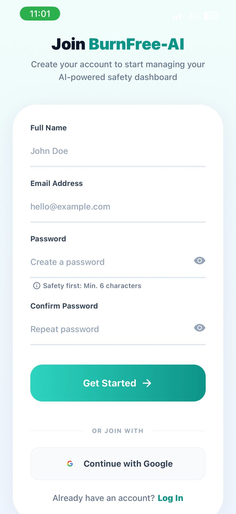
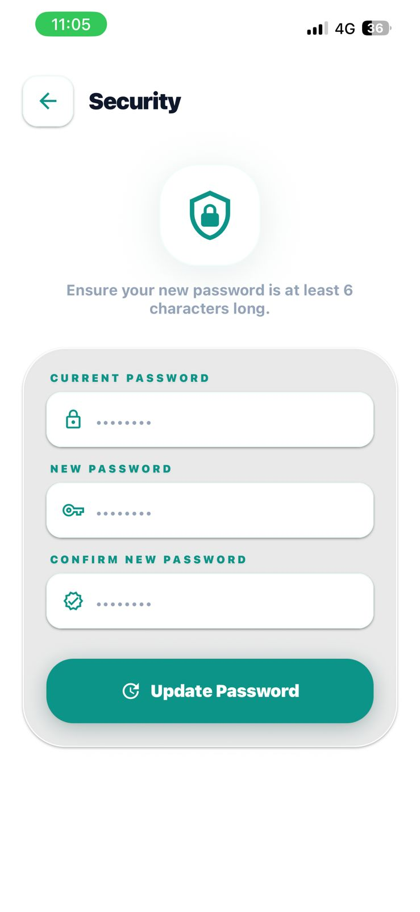
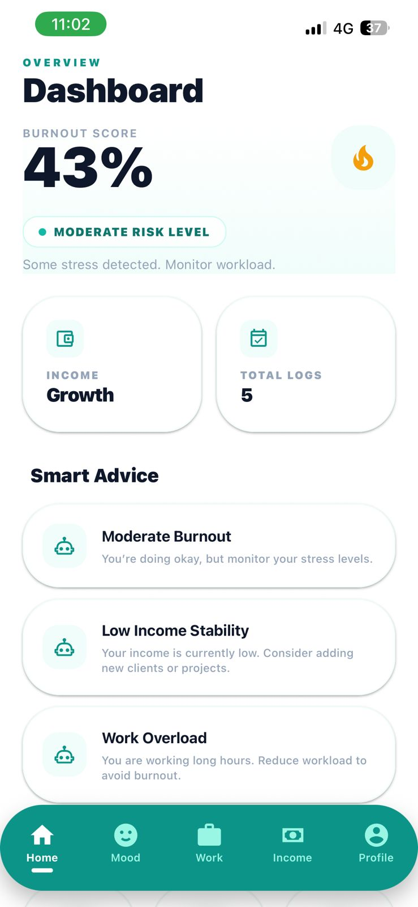
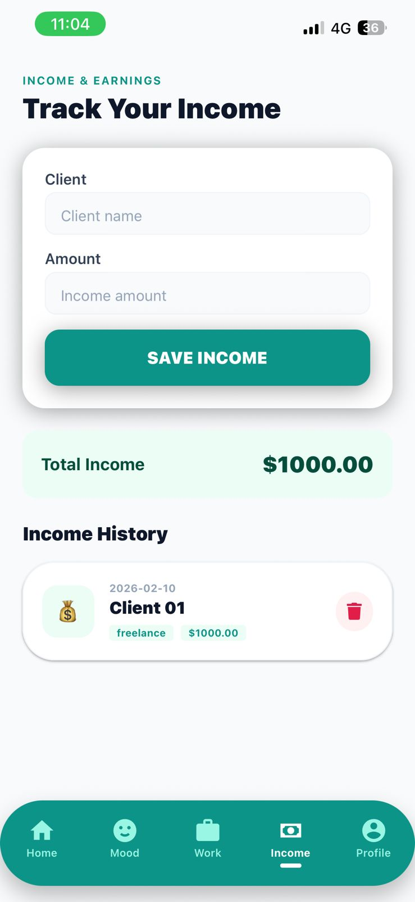
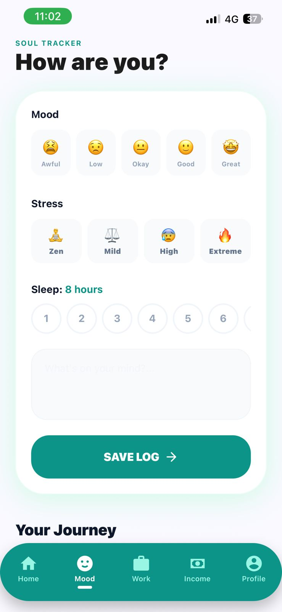
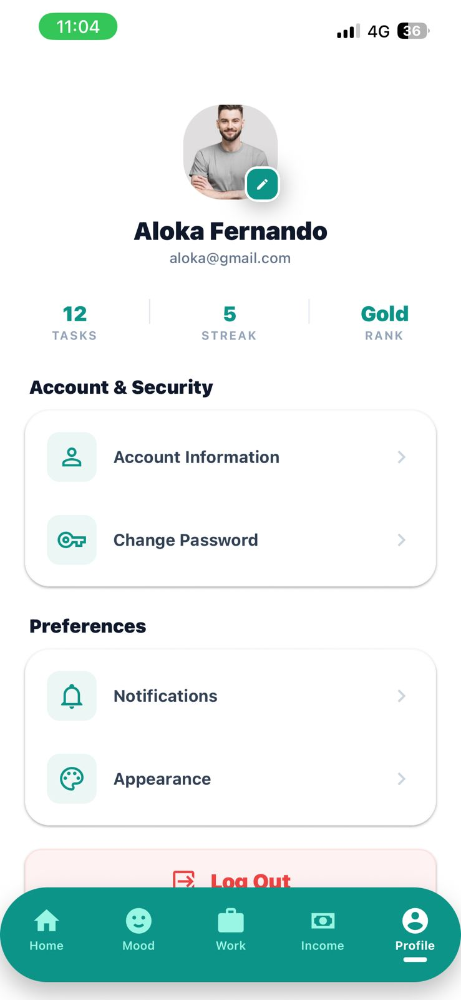
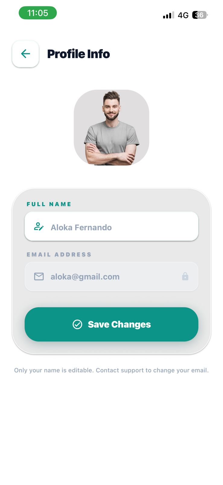
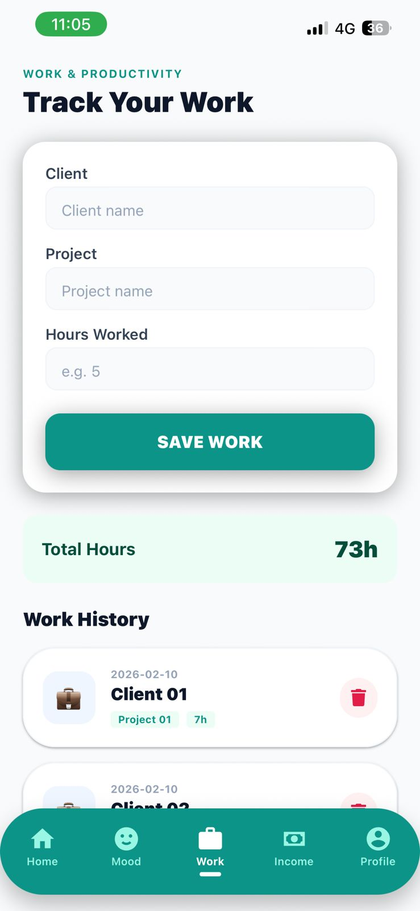
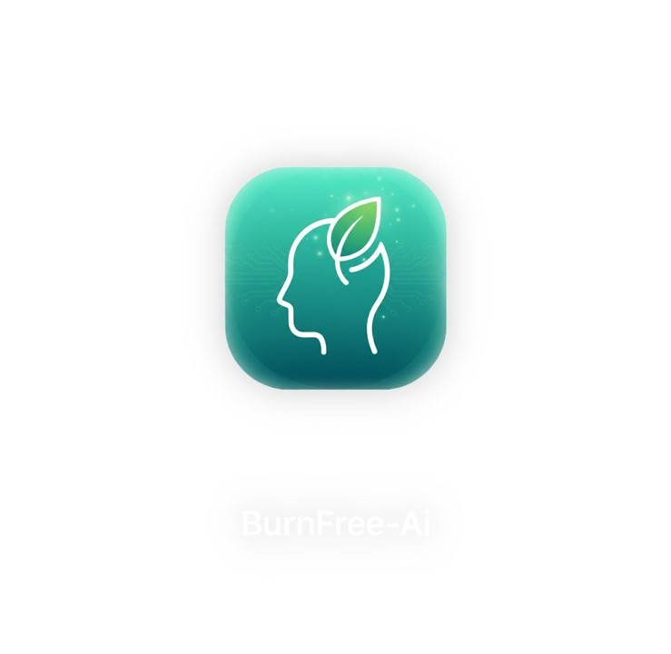

# 🔥 BurnFree AI – Intelligent Mental Wellness & Burnout Prevention Mobile App

<p align="center">
  
  
  
  
  
  
</p>

---

## 📑 Table of Contents

1. [Project Overview](#project-overview)
2. [Download the App](#-download-the-app)  
3. [Screenshots](#-screenshots)  
4. [Features](#features)  
5. [Technologies Used](#technologies-used)  
6. [Project Structure](#project-structure)  
7. [Installation & Setup](#installation--setup)  
8. [Firebase Configuration](#firebase-configuration)  
9. [Future Enhancements](#future-enhancements)  
10. [License](#license)  
11. [Contact & Support](#contact--support)


---

## Project Overview

**BurnFree AI** is a smart mobile application designed to help users monitor, analyze, and improve their mental well-being. The app allows users to track their **mood, stress levels, and sleep patterns** while providing **AI-driven insights** to guide them toward better emotional balance and burnout prevention.

The main goal of BurnFree AI is to provide **personalized analytics** for each user, helping them identify trends, understand their mental health patterns, and make informed decisions to reduce stress and improve productivity. The app is ideal for students and professionals seeking a simple yet effective tool to manage their mental health in daily life.

Key highlights include:
- Interactive dashboard for tracking mood, stress, and sleep
- Personalized insights and recommendations
- Secure user accounts with cloud storage
- AI-driven analysis for preventive mental health care

---


## 📥 Download the App

You can download and install **BurnFree AI** on your Android device:

- **APK (Android only):** [Download APK](#)

> ⚠️ The link will be updated once the APK is available or the app is published via EAS Build.


---

## 📸 Screenshots

Here are some screenshots of **BurnFree AI** in action:

### 🔐 Login Screen


### 🔐 Register Screen


### 🔐 Forget Password


### 📊 Dashboard


### 📈 Income / Stats Screen


### 🧠 Mood Tracker


### ⚙️ Settings


### 👤 User Details


### 🏢 Work / Activity Screen


### 🖥 Application Overview


---

## Features

BurnFree AI offers a variety of features designed to help users monitor and improve their mental health effectively:

- 🧠 **Mood Tracking:** Record daily moods to identify emotional patterns over time.  
- 😌 **Stress Monitoring:** Track stress levels and detect periods of high tension.  
- 💤 **Sleep Pattern Recording:** Log sleep duration and quality to see its effect on mental well-being.  
- 📊 **Personalized Analytics:** AI-driven insights based on individual user data to highlight trends and areas for improvement.  
- 🔐 **Secure User Authentication:** Each user has a private account with data securely stored in Firebase.  
- 🌐 **Cloud Data Storage:** User data is safely stored in Firebase for accessibility across devices.  
- 🖥️ **Interactive Dashboard:** Visual charts and summaries make it easy to understand personal trends.  
- 🤖 **AI-Based Recommendations:** Receive actionable advice and tips for stress reduction and emotional balance.

---

## Technologies Used

BurnFree AI is built using modern mobile development tools and cloud technologies to provide a seamless and intelligent user experience:

**Frontend (Mobile App):**  
- **React Native** – Cross-platform mobile app development framework  
- **Expo** – Simplified development and deployment environment  
- **TypeScript** – Strongly-typed JavaScript for better code reliability
- **NativeWind** – Tailwind CSS utility classes for styling React Native components  

**Backend & Database:**  
- **Firebase Authentication** – Secure user login and registration  
- **Firebase Firestore** – Cloud database for storing user data and analytics  

**Other Libraries & Tools:**  
- **React Navigation** – Smooth screen navigation  
- **Vector Icons** – Custom icons for UI elements  
- **Animated API** – Smooth animations and transitions  
- **EAS Build** – For building production-ready apps  

---

## Project Structure

The BurnFree AI project is organized to separate features, components, and services for easy maintenance and scalability:

```
BurnFree-AI/
│
├── app/                           # Expo Router navigation (file-based routing)
│   ├── (auth)/                    # Authentication flow (Login, Register)
│   ├── (dashboard)/               # Main application screens
│   ├── _layout.tsx                # Root layout configuration
│   └── index.tsx                  # App entry point
│
├── assets/                        # Images, icons, and other media files
├── components/                    # Reusable UI components (buttons, cards, loaders)
├── config/                        # Cloudinary configuration 
├── hooks/                         # Custom React hooks
├── services/                      # Firebase configuration, API calls, helper functions
│
├── store/                         # Redux / Zustand store management
│   ├── index.ts                   # Store entry point
│   ├── slice/                     # Slice files for state management
|
├── types/                         # TypeScript types for store
│
├── App.tsx                        # Main entry point of the application
├── .gitignore                     # Git ignore configuration
├── app.json                       # Expo configuration
├── eas.json                       # EAS build settings
├── babel.config.js                # Babel configuration
├── eslint.config.js               # ESLint configuration
├── expo-env.d.ts                   # Expo TypeScript environment
├── global.css                      # Global styling
├── package.json                    # Project dependencies and scripts
└── README.md                       # Project README

└── package.json # Project dependencies and scripts
```

---

## Installation & Setup

Follow these steps to set up **BurnFree AI** locally on your machine for development:

### 1️⃣ Clone the Repository
```bash
git clone https://github.com/your-username/BurnFree-AI.git](https://github.com/Alokafernando/BurnFree-AI
```

### 2️⃣ Navigate to the Project Directory

```
cd BurnFree-AI
```

### 3️⃣ Install Dependencies

Make sure you have Node.js and npm installed.

```
npm install
```

###4️⃣ Configure Firebase and Cloudinary

 - Firebase and Cloudinary configuration files are located in the config/ and services/ folders.

 - Make sure your Firebase project credentials and Cloudinary API keys are correctly added there.

   
### 5️⃣ Run the Development Server

Start the Expo development server:

```
npx expo start
```

---

## Firebase Configuration

BurnFree AI uses **Firebase** for authentication, cloud storage, and real-time data management. Follow these steps to configure Firebase in your local setup:

### 1️⃣ Create a Firebase Project
- Go to [Firebase Console](https://console.firebase.google.com/) and create a new project.
- Enable **Firestore Database** and **Authentication**.

### 2️⃣ Enable Authentication
- Go to **Authentication → Sign-in Method**.
- Enable **Email/Password** login for user accounts.

### 3️⃣ Set Up Firestore Database
- Create a Firestore database in **production or test mode**.
- Add collections to store user data such as:
  - `users` → User profiles
  - `moodEntries` → Mood tracking data
  - `stressEntries` → Stress tracking data
  - `sleepEntries` → Sleep tracking data

### 4️⃣ Configure Firebase in the Project
- Open `services/firebase.ts` (or `services/firebase.js`).
- Replace the Firebase configuration with your project credentials:

```javascript
import { initializeApp } from "firebase/app";
import { getAuth } from "firebase/auth";
import { getFirestore } from "firebase/firestore";

const firebaseConfig = {
  apiKey: "YOUR_FIREBASE_API_KEY",
  authDomain: "YOUR_PROJECT_ID.firebaseapp.com",
  projectId: "YOUR_PROJECT_ID",
  storageBucket: "YOUR_PROJECT_ID.appspot.com",
  messagingSenderId: "YOUR_MESSAGING_SENDER_ID",
  appId: "YOUR_APP_ID",
};

const app = initializeApp(firebaseConfig);
export const auth = getAuth(app);
export const db = getFirestore(app);
```

---

## Future Enhancements

BurnFree AI is actively being improved, and the following features are planned for future releases:

- 🌐 **Multi-Language Support:** Allow users to interact with the app in multiple languages.  
- 📈 **Advanced AI Analytics:** Improve AI predictions for mood, stress, and sleep patterns.  
- 🗓 **Reminders & Notifications:** Remind users to log their mood, stress, and sleep.  
- 🤝 **Community Support:** Add peer-support features or anonymous group discussions.  
- 🧩 **Integration with Wearables:** Sync data from fitness trackers for more accurate health insights.  
- 🎯 **Gamification:** Introduce achievements and goals to motivate consistent mental health tracking.  

> These enhancements aim to make BurnFree AI more interactive, personalized, and effective for users.

---

## Contact

Creator and maintainer of **BurnFree AI**  

- LinkedIn: [Your LinkedIn Profile](https://www.linkedin.com/in/your-profile)  
- GitHub: [Your GitHub Profile](https://github.com/your-username)  

This project was developed as part of academic and personal research in **Advanced Mobile Developer**.

---

## License

This project is licensed under the **MIT License**.  

You are free to use, modify, and distribute this project for personal and commercial purposes. See the [LICENSE](LICENSE) file for more details.

---

## Contact & Support

For any questions, suggestions, or issues regarding **BurnFree AI**, you can reach out to the author:  

- **Email:** buddhikafernando19@gmail.com
- **GitHub Issues:** [Submit an Issue]([https://github.com/Alokafernando/BurnFree-AI/issues](https://github.com/Alokafernando))  
- **LinkedIn:** [Buddhika Fernando](https://www.linkedin.com/in/buddhika-fernando-73606131a/)  

We highly appreciate your feedback and contributions to improve the app!


